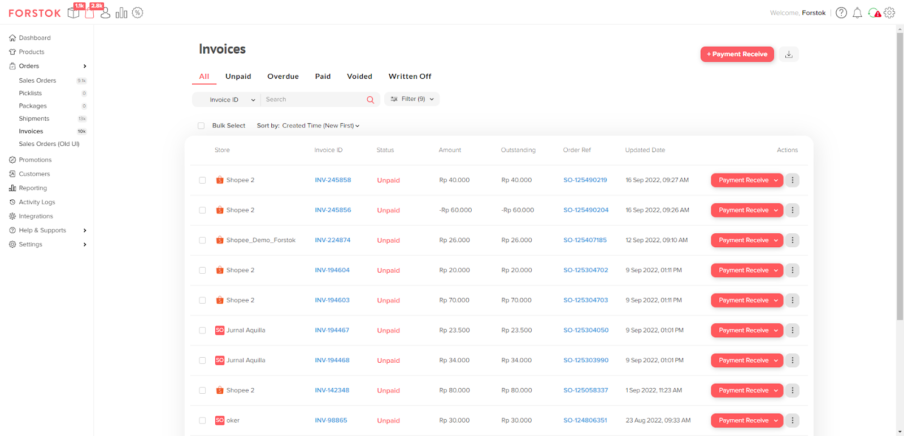

# Sales Invoice Overview (NEW)

Faktur Penjualan atau _Sales Invoice_ merupakan fitur untuk membuat faktur pada _sales order_ tersebut.

<figure><figcaption></figcaption></figure>

_Sales Invoice_ dapat dibuat secara otomatis berdasarkan Status pada Sales Orders. Untuk mengatur _Trigger_ tersebut, dapat diakses melalui menu “Setting -> Invoice”. Selain mengatur _Trigger_ untuk membuat Invoice secara Otomatis, Anda juga dapat mengatur _Due Date_, _Customer Note_, dan _Terms & Conditions_ pada halaman Setting tersebut.

<figure><figcaption></figcaption></figure>

**Note:**

* Saat ini _Invoice_ hanya dapat dibuat secara Otomatis berdasarkan Status Sales Orders
* Jika Anda memilih “Create Invoice Automatically”, maka artinya _Invoice_ tersebut tidak akan dibuat (Off)
* Pengertian Status Sales Order untuk _Trigger Invoice_ adalah sebagai berikut:
* _Open_ = SO Status “Open”
* _Printed_ = SO Status “Not Shipped”
* _Ready to Ship_ = SO Status “Ready to Ship”
* _Shipped_ = SO Status “Shipped ”
* _Delivered_ = SO Status “Delivered ”

Setelah _Invoice_ terbuat secara otomatis berdasarkan Status pada Sales Order yang telah Anda pilih sebelumnya, saat ada Order baru, akan terbuat secara otomatis _Invoice_ dengan status _Unpaid_ yang berkaitan dengan Order tersebut. Anda dapat melihat List dari _Invoice_ pada menu Orders -> Invoices.

<figure><figcaption></figcaption></figure>

Untuk dapat melihat detail dari _Invoice_ tersebut, Anda dapat klik pada Invoice ID dan akan langsung diarahkan pada halaman _Invoice Detail_.

<figure><figcaption></figcaption></figure>

## **Invoice List**

<figure><figcaption></figcaption></figure>

Pada halaman _Invoice_, Anda dapat melihat seluruh _Invoice_ yang telah terbuat secara otomatis. Anda dapat dengan mudah melakukan filter berdasarkan status _Invoice_ tersebut menggunakan tab-tab yang ada (Seperti halaman Sales Order). Terdapat kolom-kolom dengan penjelasan sebagai berikut:

* Store = Nama store dengan logo Channel yang berelasi dengan Invoice tersebut
* Invoice ID = ID dari Invoice tersebut
* Status = Status pada Invoice tersebut, seperti:
* Unpaid = Belum terbayarkan
* Overdue = Telah melewati batas pembayaran
* Paid = Invoice telah terbayarkan
* Voided = Invoice dianggap batal
* Written Off = Invoice dianggap lunas
* Amount = Amount dari Invoice tersebut berdasarkan Sales Order
* Outstanding = Amount dari Invoice yang belum terbayarkan
* Order Ref = ID Sales Order yang berelasi dengan Invoice tersebut
* Updated At = Tanggal dan waktu Invoice tersebut terbarukan
* Actions = Actions yang dapat Anda lakukan terhadap Invoice tersebut:
* Payment Receive = Mendapatkan Fixed Amount untuk melakukan update terhadap Amount yang ada pada Invoice tersebut menggunakan API atau Manual Input
* Mark as Void = Membuat Invoice tersebut menjadi batal
* Mark as Written Off = Membuat Invoice tersebut dianggap lunas
* Print Invoice = Melakukan Print terhadap Invoice tersebut.

Di Invoice list Anda juga dapat melakukan pencarian menggunakan Invoice ID, Sales Order ID, Channel Order ID, dan Customer Name (Yang tidak termasking). Selain itu, Anda juga dapat melakukan Filter berdasarkan Store yang Anda miliki beserta Filter berdasarkan Warehouse. Serta, Anda dapat melakukan sorting berdasarkan urutan terbaru dan terlama.
