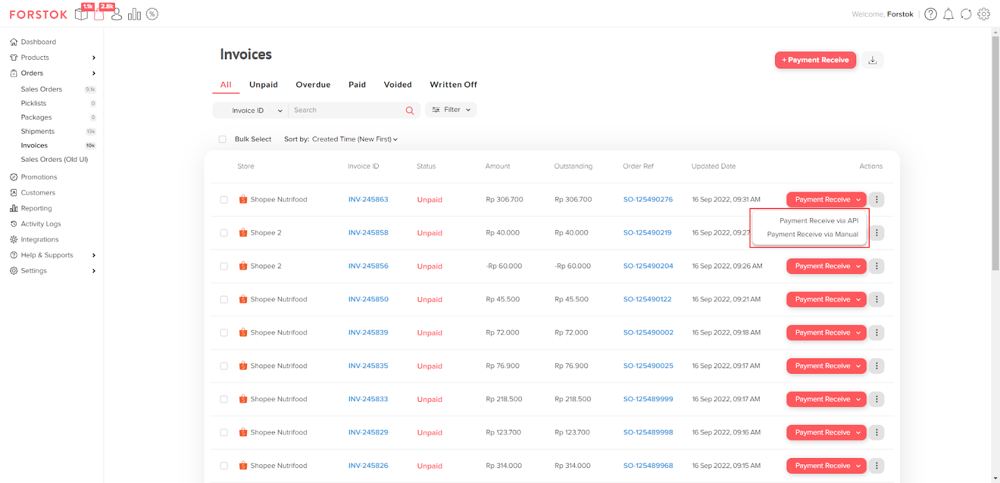

# Sales Invoice Overview (NEW)

Faktur Penjualan atau _Sales Invoice_ merupakan fitur untuk membuat faktur pada _sales order_ tersebut.

<figure><figcaption></figcaption></figure>

_Sales Invoice_ dapat dibuat secara otomatis berdasarkan Status pada Sales Orders. Untuk mengatur _Trigger_ tersebut, dapat diakses melalui menu “Setting -> Invoice”. Selain mengatur _Trigger_ untuk membuat Invoice secara Otomatis, Anda juga dapat mengatur _Due Date_, _Customer Note_, dan _Terms & Conditions_ pada halaman Setting tersebut.

<figure><figcaption></figcaption></figure>

**Note:**

* Saat ini _Invoice_ hanya dapat dibuat secara Otomatis berdasarkan Status Sales Orders
* Jika Anda memilih “Create Invoice Automatically”, maka artinya _Invoice_ tersebut tidak akan dibuat (Off)
* Pengertian Status Sales Order untuk _Trigger Invoice_ adalah sebagai berikut:
  * _Open_ = SO Status “Open”
  * _Printed_ = SO Status “Not Shipped”
  * _Ready to Ship_ = SO Status “Ready to Ship”
  * _Shipped_ = SO Status “Shipped ”
  * _Delivered_ = SO Status “Delivered ”

Setelah _Invoice_ terbuat secara otomatis berdasarkan Status pada Sales Order yang telah Anda pilih sebelumnya, saat ada Order baru, akan terbuat secara otomatis _Invoice_ dengan status _Unpaid_ yang berkaitan dengan Order tersebut. Anda dapat melihat List dari _Invoice_ pada menu Orders -> Invoices.

<figure><figcaption></figcaption></figure>

Untuk dapat melihat detail dari _Invoice_ tersebut, Anda dapat klik pada Invoice ID dan akan langsung diarahkan pada halaman _Invoice Detail_.

<figure><figcaption></figcaption></figure>

## **Invoice List**

<figure><figcaption></figcaption></figure>

Pada halaman _Invoice_, Anda dapat melihat seluruh _Invoice_ yang telah terbuat secara otomatis. Anda dapat dengan mudah melakukan filter berdasarkan status _Invoice_ tersebut menggunakan tab-tab yang ada (Seperti halaman Sales Order). Terdapat kolom-kolom dengan penjelasan sebagai berikut:

* Store = Nama store dengan logo Channel yang berelasi dengan Invoice tersebut
* Invoice ID = ID dari Invoice tersebut
* Status = Status pada Invoice tersebut, seperti:
  * Unpaid = Belum terbayarkan
  * Overdue = Telah melewati batas pembayaran
  * Paid = Invoice telah terbayarkan
  * Voided = Invoice dianggap batal
  * Written Off = Invoice dianggap lunas
* Amount = Amount dari Invoice tersebut berdasarkan Sales Order
* Outstanding = Amount dari Invoice yang belum terbayarkan
* Order Ref = ID Sales Order yang berelasi dengan Invoice tersebut
* Updated At = Tanggal dan waktu Invoice tersebut terbarukan
* Actions = Actions yang dapat Anda lakukan terhadap Invoice tersebut:
  * Payment Receive = Mendapatkan Fixed Amount untuk melakukan update terhadap Amount yang ada pada Invoice tersebut menggunakan API atau Manual Input
  * Mark as Void = Membuat Invoice tersebut menjadi batal
  * Mark as Written Off = Membuat Invoice tersebut dianggap lunas
  * Print Invoice = Melakukan Print terhadap Invoice tersebut.

Di Invoice list Anda juga dapat melakukan pencarian menggunakan Invoice ID, Sales Order ID, Channel Order ID, dan Customer Name (Yang tidak termasking). Selain itu, Anda juga dapat melakukan Filter berdasarkan Store yang Anda miliki beserta Filter berdasarkan Warehouse. Serta, Anda dapat melakukan sorting berdasarkan urutan terbaru dan terlama.

## **Invoice Detail**

<figure><figcaption></figcaption></figure>

Pada halaman Invoice Detail, terdapat informasi _Created Date_, _Channel, Store_, _Channel Order ID_, _Invoice Ref Number_, _Item(s) Information_, dan _Amount_ dari Invoice tersebut. Terdapat juga “Shortcut” informasi dari Sales Order yang berkaitan dengan Invoice tersebut.

Saat pertama kali Invoice tersebut dibuat, Amount akan “meng-_copy_” dari Amount yang ada di Sales Order. Dan akan berubah apabila Anda telah melakukan _Payment Receive_. Di halaman ini terdapat juga _action(s)_ seperti yang ada pada halaman Invoice List.

## **Payment Receive**

<figure><figcaption></figcaption></figure>

<figure><figcaption></figcaption></figure>

Anda bisa mendapatkan **Fixed Amount** berdasarkan Order dengan menggunakan Action “_Payment Receive via API_”, atau Anda juga dapat melakukan input secara Manual dengan menggunakan Action “_Payment Receive via Manual_”.

## **Payment Receive via API**

<figure><figcaption></figcaption></figure>

Fitur ini berguna untuk Anda dapat melihat rincian pengurangan maupun penambahan dari Order tersebut langsung secara otomatis terisi Amountnya yang didapatkan dari masing-masing _Channel/Marketplace_. Untuk menggunakan fitur ini, pastikan Anda sudah menyalakan _Invoice_, karena pembayaran yang terima akan berelasi dengan _Invoice_.

Adapun penjelasan dari masing-masing field di atas sebagai berikut:

* _Sub Total_: Jumlah dari penjumlahan Item
* _Voucher Amount_: Voucher yang dibuat oleh Seller
* _Service Fee_: Biaya Layanan, Biaya Platform, Komisi, Biaya Admin, Biaya Program, dll
* _Platform Rebate_: Cashback dari Marketplace/Channel
* _Shipping Difference_: Pengurangan selisih pengiriman berdasarkan berat sebenarnya.
* _Total_: Sub Total - Voucher Amount - Service Fee + Platform Rebate + Shipping (if non-cashless)
* _Balance Due_: Outstanding invoice amount

**Available Channel:**

* Shopee
* Tokopedia

**Note:**

* Saat ini _Payment Receive via API_ baru tersedia untuk _marketplace_ Shopee dan Tokopedia, kedepannya akan ditambahkan _channel-channel_ lainnya yang memungkinkan dan apabila menyediakan API tersebut.
* _Balance Due_ akan secara otomatis menjadi **“0”** setelah Anda melakukan _Payment Receive_ dan Save data tersebut.
* Shipping Cashless tidak termasuk ke dalam hitungan karena akan dibayarkan secara otomatis oleh _Channel/Marketplace_ ke masing-masing jasa kirim (Anda tidak menerima uang atas _Shipping Cashless_ tersebut).
* Saat Anda melakukan _Payment Receive_, _Amount_ yang ada pada Invoice Detail akan ter-_replace_ secara otomatis mengikuti _Amount_ yang diterima dari API/Input dari Anda.
* Apabila sistem gagal dalam pengambilan _Amount_ dari API, akan secara otomatis menampilkan Form yang dapat Anda isi secara manual.

<figure><figcaption></figcaption></figure>

****
