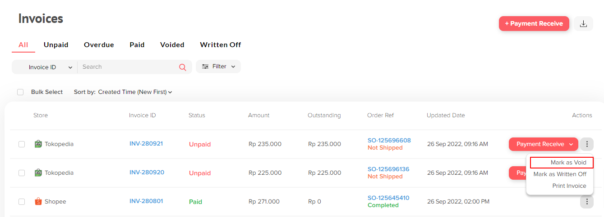

# Mark Invoice as Void

Mark as Void merupakan Action yang dapat digunakan untuk menandakan invoice tersebut sudah batal. Namun, apabila Sales Order tersebut sudah “Canceled”, maka Invoice akan secara otomatis menjadi **Voided**.

<figure><figcaption></figcaption></figure>
