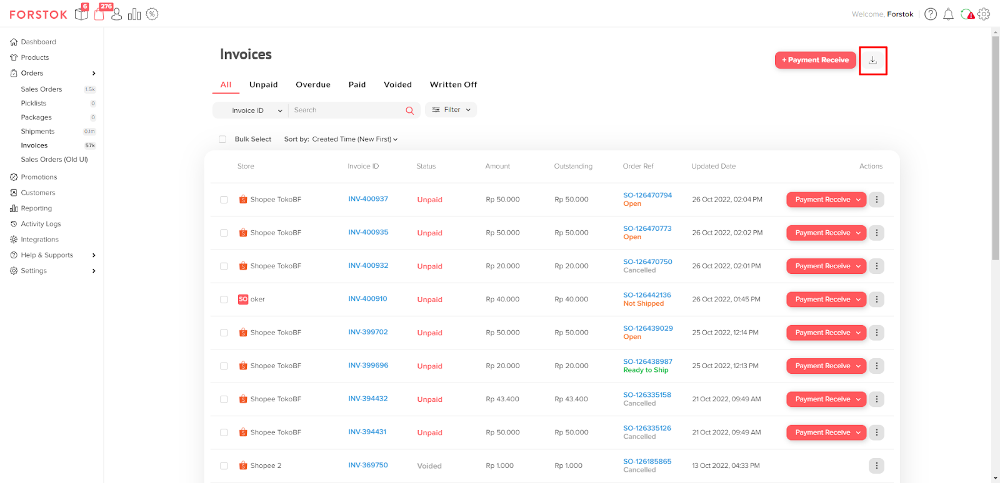
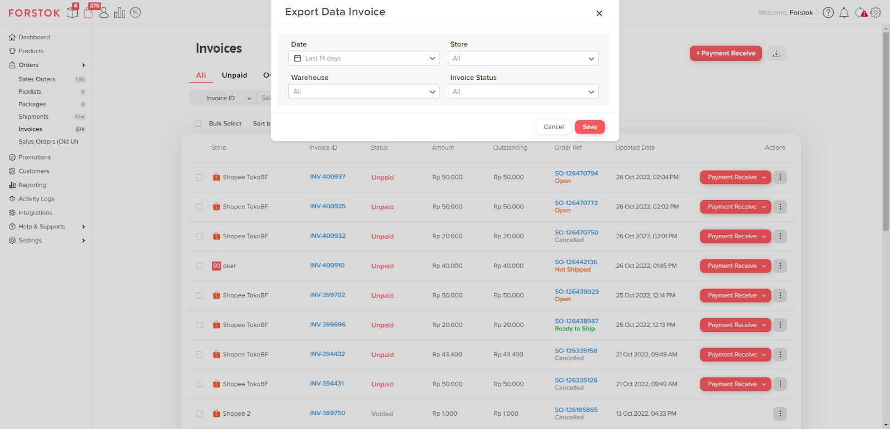
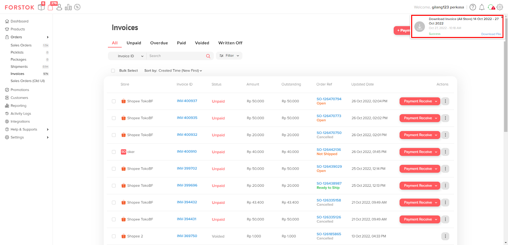
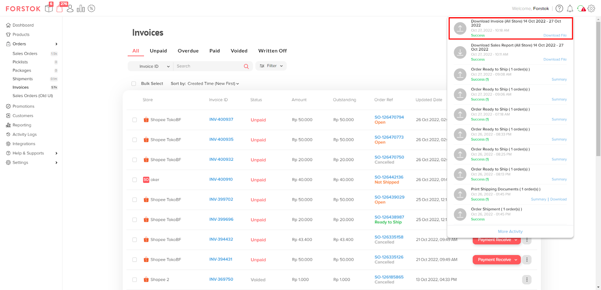

# Export Invoice

Untuk melakukan Export Invoice dari data Invoice yang telah terbuat secara otomatis di akun Forstok, pada halaman **Invoice**, klik pada **Icon Download**.

<figure><figcaption></figcaption></figure>

Lalu akan ditampilkan Pop-up untuk Anda melakukan sorting terhadap data-data yang akan di Export dalam bentuk .xls.

<figure><figcaption></figcaption></figure>

Anda dapat memilih rentang tanggal, Store (Per-Store atau dapat All), Warehouse (Per-Warehouse atau All), dan Invoice Status (Per-Sales Order Status atau All).

Jika sudah memilih, Anda dapat klik Save.

<figure><figcaption></figcaption></figure>

Akan ditampilkan Push Notification proses Export Invoice dengan Informasi Store dan rentang tanggal.

<figure><figcaption></figcaption></figure>

Anda dapat mendownload hasil Export tersebut pada tombol “Download File” di Activity Log.

**Sample Export Invoice:** __ [https://docs.google.com/spreadsheets/d/1yeJZRKQMe0\_igA\_D665fnTtjdqfCy3C3HAEWAy5XY3E/edit?usp=sharing](https://docs.google.com/spreadsheets/d/1yeJZRKQMe0\_igA\_D665fnTtjdqfCy3C3HAEWAy5XY3E/edit?usp=sharing)
