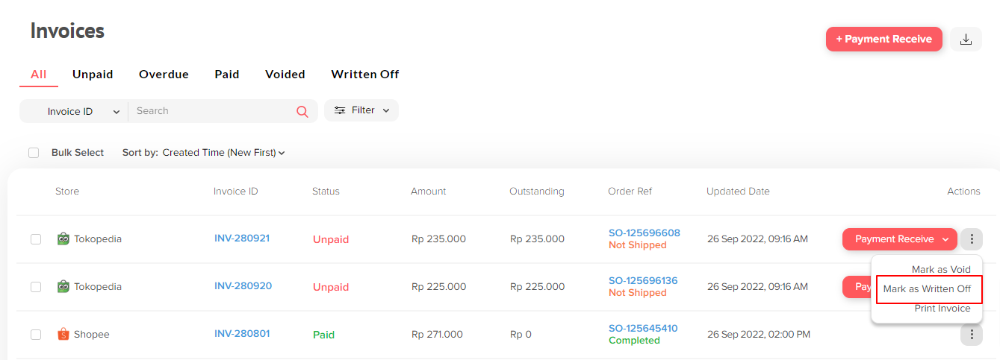

# Mark Invoice as Written Off

Mark Invoice as Written Off merupakan _Action_ yang dapat digunakan untuk menandakan invoice yang sudah terbuat menjadi written off atau invoice tidak dapat dibayar. Invoice yang sudah di written off tidak dapat dibuat kembali, jadi item yang sudah dibuat invoicenya tidak dapat dibuat invoice lagi ketika sudah di written off.

<figure><figcaption></figcaption></figure>

Setelah menekan button "Mark as Written Off" maka akan muncul popup konfirmasi untuk menghapus invoice tersebut. Tekan "Write Off" untuk menghapus invoice tersebut.

<figure><figcaption></figcaption></figure>

Setelah Invoice tersebut berhasil di Write Off maka status invoice tersebut akan berubah menjadi Written Off.

<figure><figcaption></figcaption></figure>
