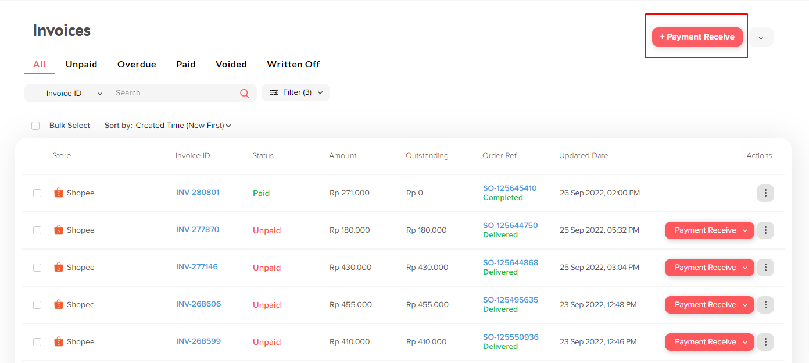
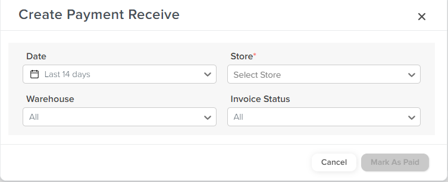

# Mass Payment Receive via API

Anda dapat melakukan Payment Receive secara massal dengan klik pada tombol “+ Payment Receive” pada Invoice List.

<figure><figcaption></figcaption></figure>

Lalu, akan ditampilkan pop-up untuk Anda memilih rentang tanggal, store, warehouse, dan Invoice Status.

<figure><figcaption></figcaption></figure>

Setelah Anda mengetuk “Mark As Paid”, maka akan secara otomatis Payment Receive ini berjalan di _Background_. Anda dapat melihat _Summary_ di _Activity Log_.

**Note:**

* Mass Payment Receive ini hanya akan melakukan Paid terhadap order-order yang sudah memiliki status “Completed” di Sales Order.
