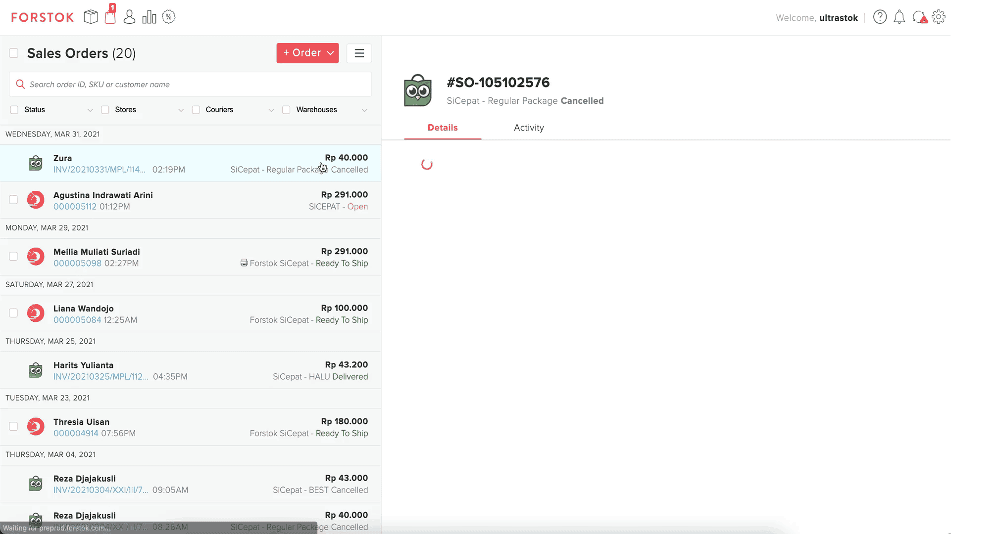
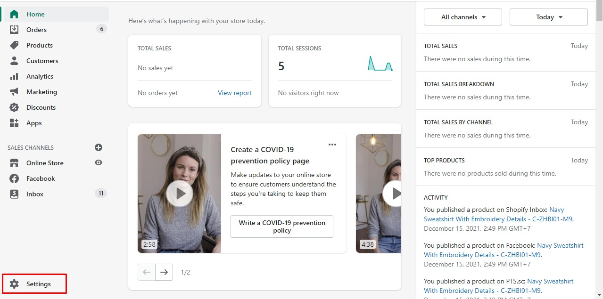
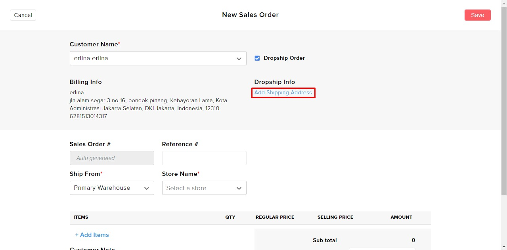
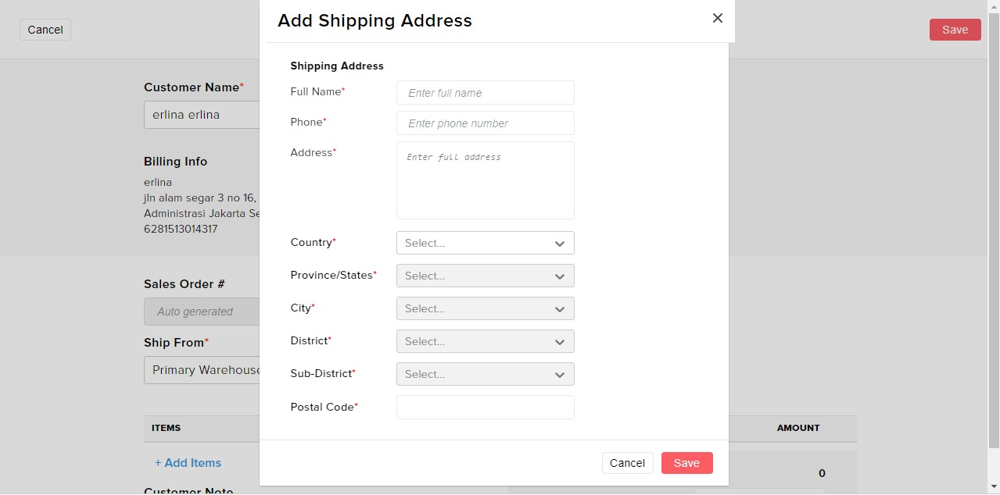
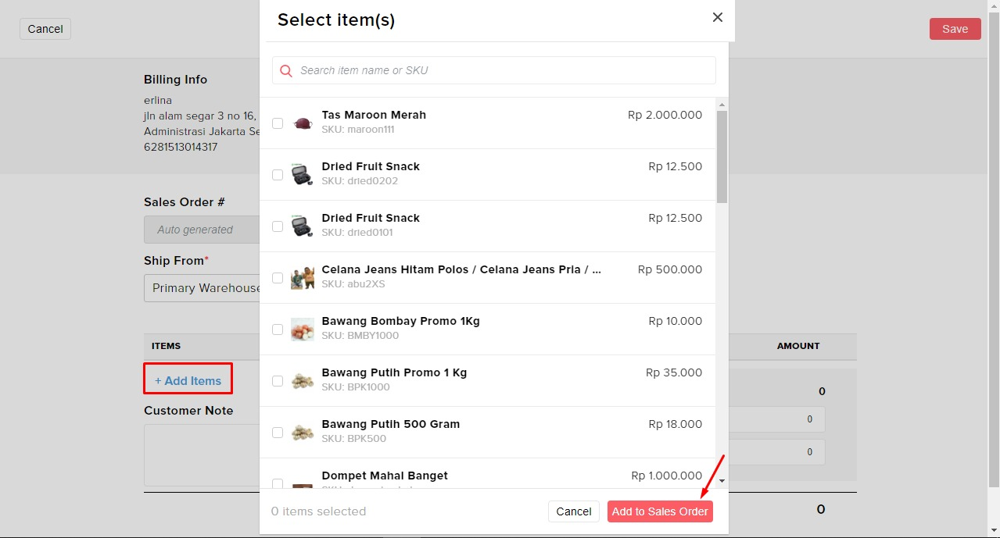

# Create Dropship Order

### Video

1. Pada menu order klik menu **+order** lalu klik **create sales order**

 .jpg>)

2\. Isi kolom seperti Customer Name, Ship From dan Store Name dan untuk dropship klik check box dropship order

 

3\. Lalu add shipping address, isi kolom add shipping address

  

4\. Add items tersebut

 

5\. lalu klik **Save**

