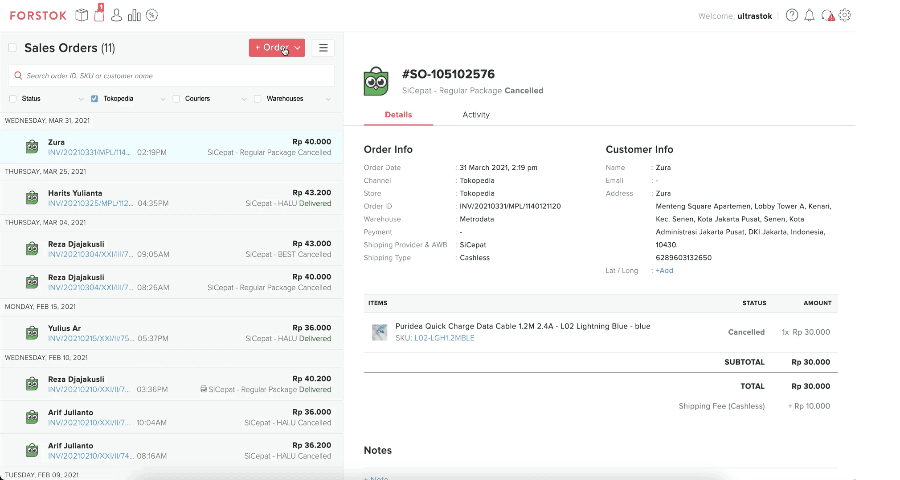
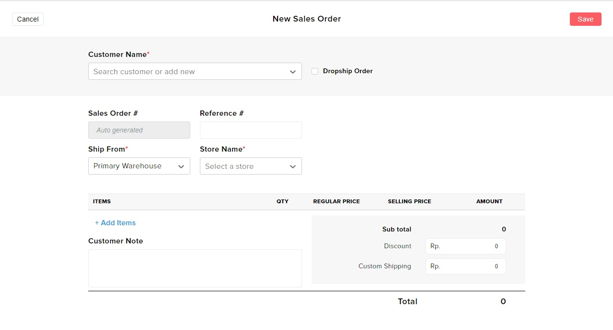
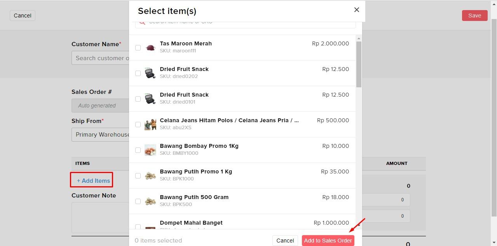

# Create Sales Order

### Video

1. **Pada menu order klik menu +order lalu klik create sales order**

**2. Isi kolom seperti Customer Name, Ship From dan Store Name dan untuk dropship klik check box dropship order**

 

**3. Add items tersebut**

 

**4. lalu klik Save**
