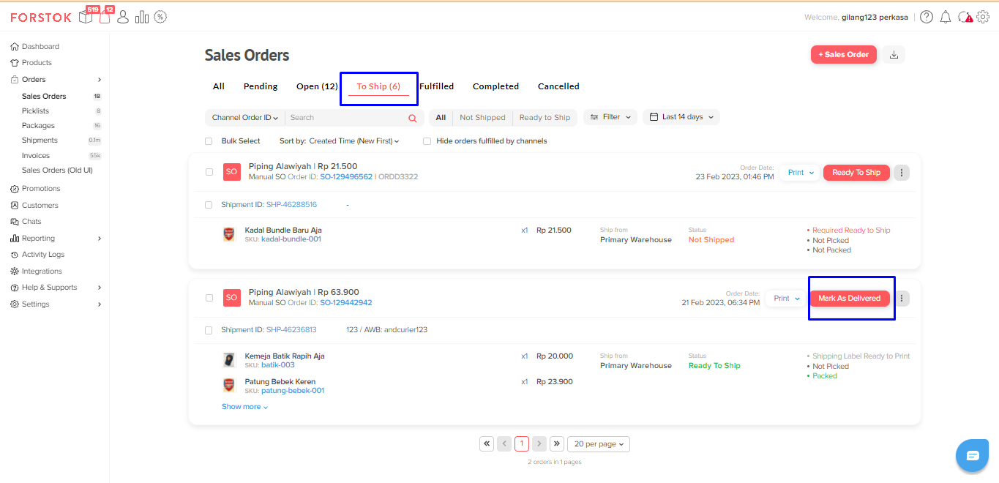

# Update Mark As Delivered

### Tampilan pada tab To Ship

<figure><figcaption></figcaption></figure>


**Note :** Jika pesanan sudah selesai dan pembeli sudah menerima, silahkan klik "mark as delivered" sehingga dapat menjadi pembeda untuk melihat pesanan yang sudah selesai dan yang belum selesai.

