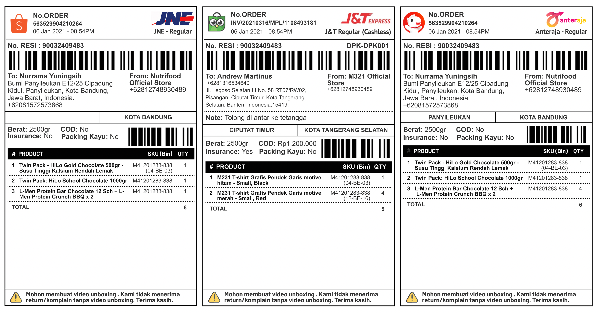
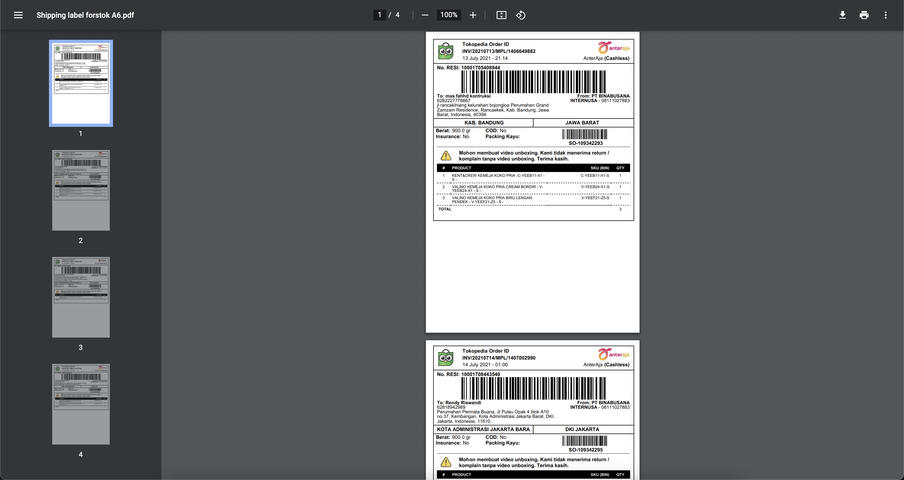

# Template Shipping Label

Please contact Forstok support to enable this feature.

You can print all Marketplaces and e-commerce website shipping label in 1 format. This format is ideal for Thermal printer 10x15cm. 

### Shipping Label: paper size A6 \(Thermal Printer 10x15cm\)

Shipping label below is ideal from Thermal printer format \(10x15cm / A6\). You can test print using sample file below:



### Shipping Label: paper size A4 \(21 × 29.7cm\)

Shipping label below is ideal when you want to print 4 label in 1 page.  Please setup printing setting before printing. You can test print using sample file below:



