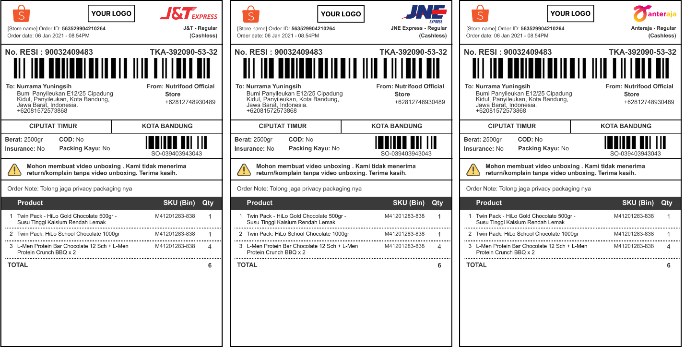
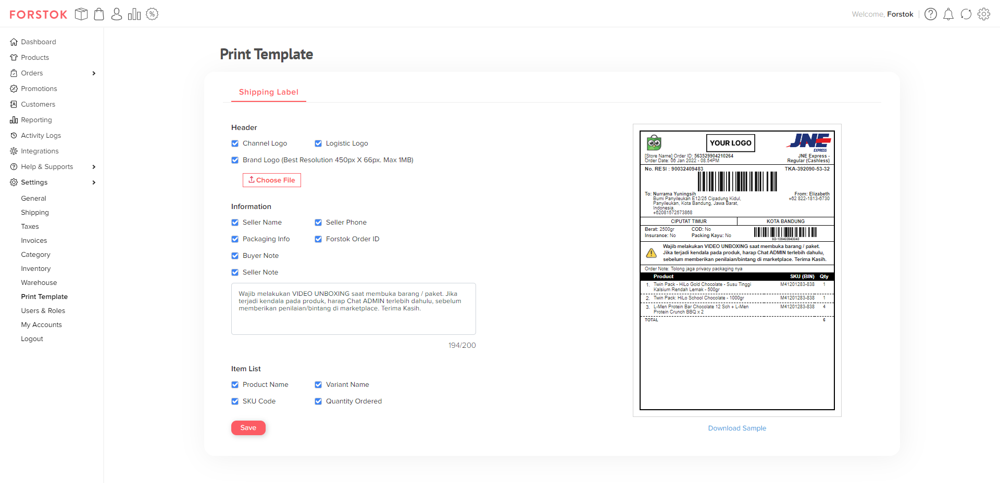

# Template Shipping Label

Saat ini seller sudah bisa melakukan cetak shipping label yang ada pada Marketplace dan E-commerce website dengan menggunakan format yang sama. Format ini dapat digunakan pada printer Thermal dengan ukuran 10x15cm.&#x20;

<figure><figcaption>
Shipping label A6
</figcaption></figure>

## **Customize Shipping Label**

Saat ini seller sudah bisa melakukan custome pada tampilan shipping label pada halaman pengaturan  Settings -> Print Template. Live Preview sudah tersedia untuk memudahkan seller pada saat melakukan custome.

<figure><figcaption>
Setting Template Print Shipping Label
</figcaption></figure>

Beberapa bentuk tampilan yang dapat diubah diantaranya sebagai berikut:

\- Enable/disable logo marketplace

\- Enable/disable logo kurir (jasa kirim)

\- Menambahkan logo toko sendiri (apabila memiliki, jika tidak maka akan kosong)

\- Enable/disable informasi nama pengirim

\- Enable/disable informasi nomor telepon pengirim

\- Enable/disable informasi paket (berat, asuransi, COD dan paket kayu)

\- Enable/disable Order ID Forstok (termasuk barcode)

\- Enable/disable catatan penjual

\- Enable/disable catatan pembeli

\- Mengubah catatan penjual

\- Enable/disable informasi mengenai nama produk

\- Enable/disable nama varian produk

\- Enable/disable kode SKU

\- Enable/disable jumlah kuantiti yang di pesan
