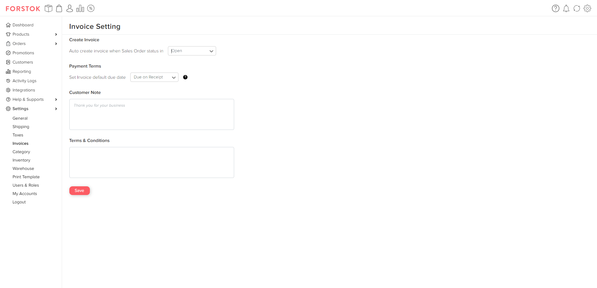

# Invoice Settings

You can set based on the order status in Forstok for the Invoice to be created automatically by the system. And, you can set the Payment Terms to be used later on the Due Date in your Invoice. In addition, you can also add Notes for Customer and Terms & Conditions.

You can set this in Settings -> Invoices.

<figure><figcaption>
Invoice Settings.
</figcaption></figure>
