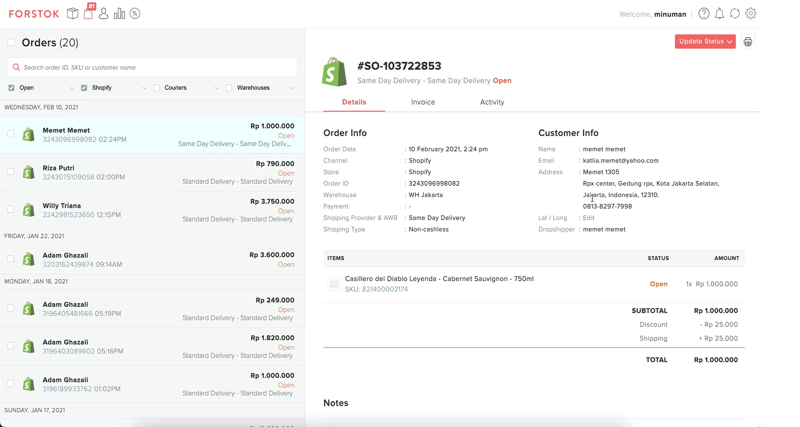

# On- demand step by step

1. Copy shipping address from order \(Skip this step if your website can identify Latitude and Longitude on map to get coordinates during checkout\)
2. Open [Google Map](%20https://maps.google.com).
3. Paste shipping address into Google Map search bar.
4. Right-click on the pin to show Latitude and Longitude information. click to copy 
5. Input Latitude and Longitude in Google map search to double check if location is correct.
6. Input Latitude and Longitude, into Lat / Long field in Forstok order page.
7. Click "Update status" to request pickup
8. Select Gosend/ grab express, click update.
9. Print shipping Label
10. Your customer will received LIVE tracking. 

Once we get the Tracking URL, we will update this to Shopify. Shopify will send email to your customers.

[https://gosend-livetracking.gojek.co.id/go-send/livetracking/detail?trackingId=0YiU1dSqm77w2izxImLQWyulSDk2Aj0hsyWbuggL8yiDSjjrTTLcRIHBbsbL85Cmw4dqeMAnwbVytq\_Sgq3rqw%3D%3D](https://gosend-livetracking.gojek.co.id/go-send/livetracking/detail?trackingId=0YiU1dSqm77w2izxImLQWyulSDk2Aj0hsyWbuggL8yiDSjjrTTLcRIHBbsbL85Cmw4dqeMAnwbVytq_Sgq3rqw%3D%3D)

