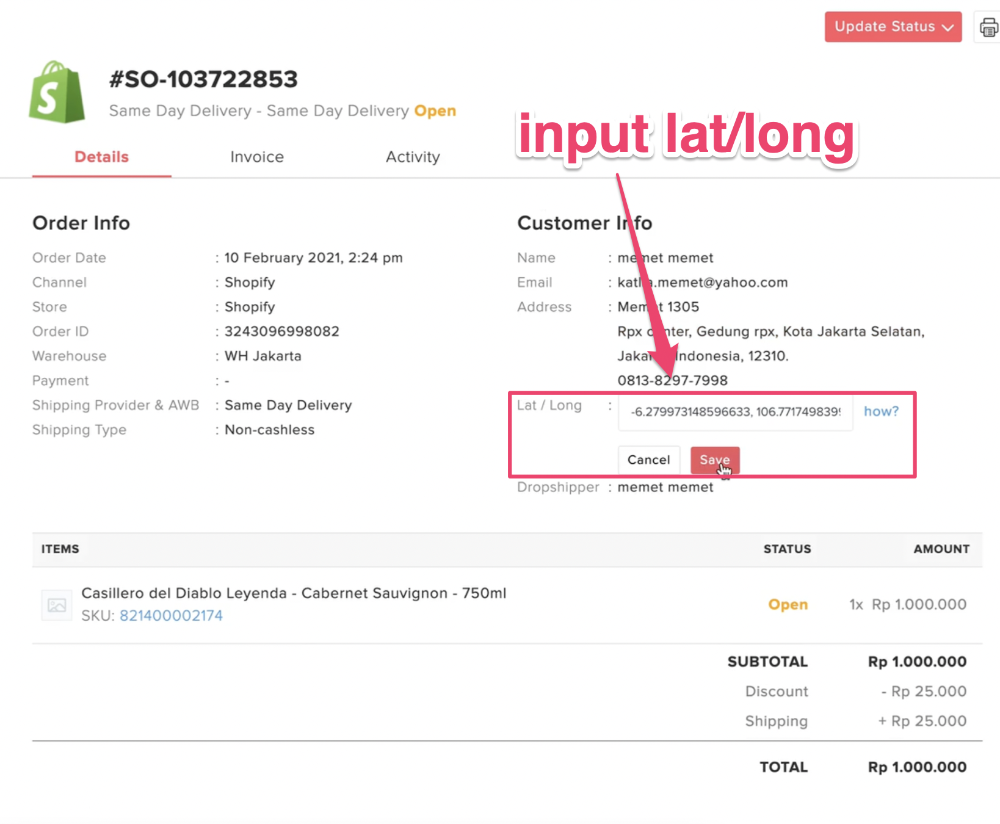

# On Demand Services

You can now accept instant couriers service \(Gosend and GrabExpress\) for your website. It's an add-on service from Forstok for a cashless payment.

**Available Service**: Instant and Same day

**Available Couriers:**

 **** 


Please contact Forstok to enable this feature. Top up payment is required. 


1. Copy shipping address from order \(Skip this step if your website can identify Latitude and Longitude on map to get coordinates during checkout\)
2. Open [Google Map](%20https://maps.google.com).
3. Paste shipping address into Google Map search bar.
4. Right-click on the pin to show Latitude and Longitude information. click to copy 
5. Input Latitude and Longitude in Google map search to double check if location is correct.
6. Input Latitude and Longitude, into Lat / Long field in Forstok order page.
7. Click "Update status" to request pickup
8. Select Gosend/ grab express, click update.
9. Print shipping Label
10. Your customer will received LIVE tracking. 

[https://gosend-livetracking.gojek.co.id/go-send/livetracking/detail?trackingId=0YiU1dSqm77w2izxImLQWyulSDk2Aj0hsyWbuggL8yiDSjjrTTLcRIHBbsbL85Cmw4dqeMAnwbVytq\_Sgq3rqw%3D%3D](https://gosend-livetracking.gojek.co.id/go-send/livetracking/detail?trackingId=0YiU1dSqm77w2izxImLQWyulSDk2Aj0hsyWbuggL8yiDSjjrTTLcRIHBbsbL85Cmw4dqeMAnwbVytq_Sgq3rqw%3D%3D) See image below.

## Limitation for Shopify


Shopify Checkout can't be customized to add Map coordinate. Gosend shipping required Map coordinate to get Latitude and Longitude.


1. **Flat shipping Fee**. 
2. **Manual input Latitude and Longitude**

## Shopify Shipping Setup

Shopify -&gt; Settings / Shipping and delivery

Create New profile

Create Shipping Zone

Input Flat Rate Shipping Fee \(Ongkir\)

