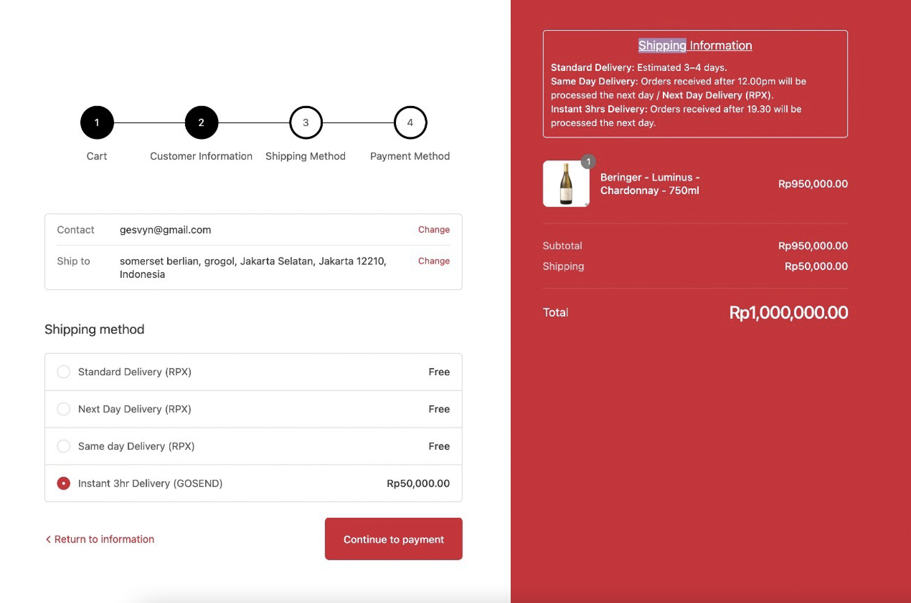
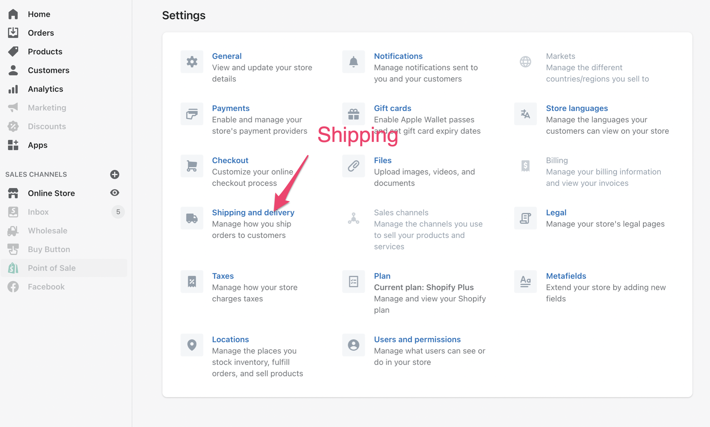
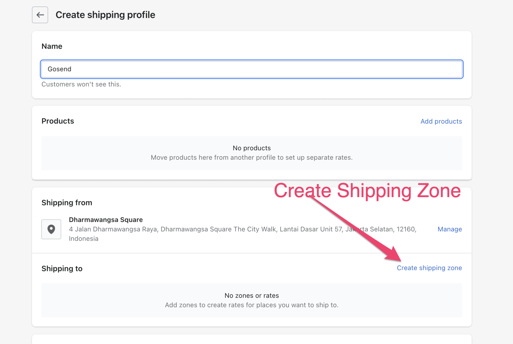
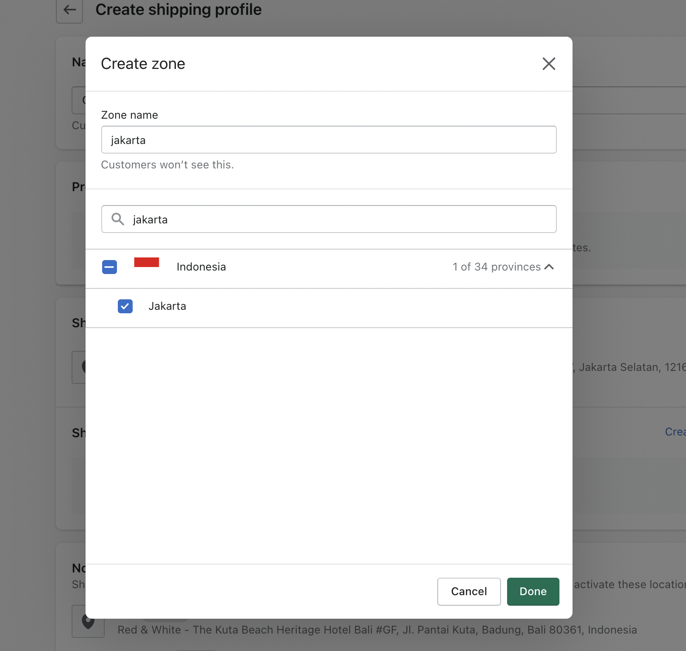
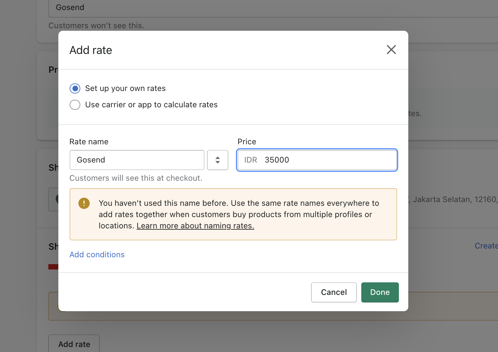

# On Demand Services

You can now accept instant couriers service (Gosend and GrabExpress) for your website. It's an add-on service from Forstok for a cashless payment.

**Available Service**: Instant and Same day

**Available Couriers:**

&#x20;**** &#x20;

## Limitation for Shopify


Shopify Checkout can't be customized to add Map coordinate. Gosend shipping required Map coordinate to get Latitude and Longitude.

If you use Magento, Woocommerce or custom Website, discuss with your vendor to implement Map coordinate to get the Latitude and Longitude information and send it to forstok via order parameter.&#x20;


1. **Flat shipping Fee**.&#x20;
2. **Manual input Latitude and Longitude**

.png>)

3\. Update status Ready to Ship

.png>)

4\. Pilih instand couriernya, lalu klik Update. Maka status berubah jadi Ready to Ship dan siap di pick up

.png>)

## Shopify Shipping Setup

Shopify -> Settings / Shipping and delivery

Create New profile

Create Shipping Zone

Input Flat Rate Shipping Fee (Ongkir)

Add Rate. Flat Rate. You can always update the shipping rate later once you have average shipping fee based on usage.&#x20;

