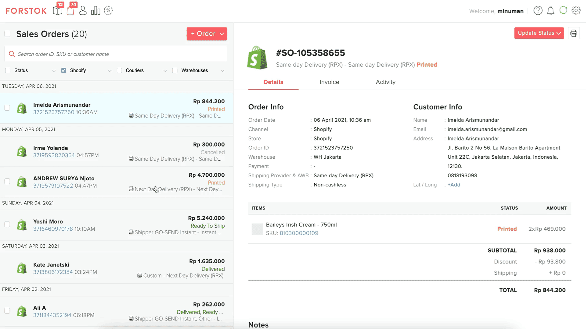

# Regular Services

You can now accept Regular Service  for your website.  It's an add-on service from Forstok for a cashless payment.

**Available Service**: Regular, Next day, Cargo

**Available Couriers: **


Please contact Forstok to enable this feature. Top up payment is required.&#x20;


### Video

**Step by step**

1 Orderan yang baru masuk bersatus Open atau Printed (belum RTS), klik update status lalu Ready to Ship

.png>)

2\. Pilih kurir, lalu klik Update untuk Ready to Ship dan mendapatkan AWB

.png>)

3\. Maka orderan tersebut sudah berstatus Ready to Ship dan siap di pick up kurir
